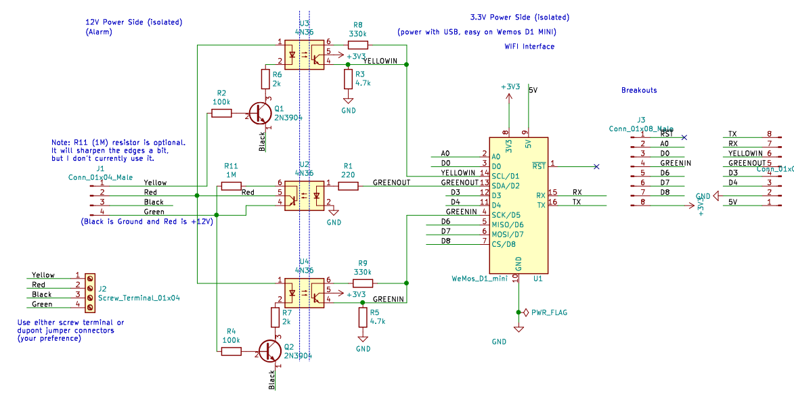

# Honeywell / Resideo Vista Alarm Panel — ESPHome IDF External Component

An [ESPHome](https://esphome.io) external component that interfaces directly with a Honeywell / Resideo / Ademco Vista alarm panel via the ECP keypad bus, enabling full monitoring and control through Home Assistant.

## Supported Panels

| Panel | Protocol |
|---|---|
| Vista 15P / 20P / Ademco 4140XMPT2 | Standard (default) |
| Vista 15SE / 20SE | Legacy (`legacy_protocol: true`) |

> Other Vista-series panels that use the ECP keypad bus may work but have not been tested.

## Key Features

- Monitor zone open/close status (hardwired and RF wireless zones)
- Arm, disarm, and send keypad commands from Home Assistant
- Virtual keypad LCD display (line1/line2 text sensors)
- Zone expansion emulation via expander board emulation
- RF receiver emulation (5881ENH compatible) supporting both virtual software-defined RF zones and physical Honeywell 5800-series 345 MHz wireless sensors when combined with an inexpensive CC1101 sub-GHz transceiver; includes a direct fast-path that publishes RF sensor state to Home Assistant immediately on packet receipt, eliminating the 50–500 ms delay introduced by the panel's ECP polling cycle
- Long Range Radio (LRR) monitoring emulation
- AUI interface for faster hardwired zone closure reporting and automatic panel clock sync
- Multi-partition support (up to 8 partitions)
- System status: armed state, ready, trouble, alarm, fire, AC power, battery

## Why This Fork?

This is a highly modified fork of [Dilbert66/esphome-vistaECP](https://github.com/Dilbert66/esphome-vistaECP). Key differences:

- Uses one or two hardware UARTs on the ESP32 instead of software GPIO bit-banging. This provides more reliable, timing-accurate communication with the panel.
- Complete Arduino dependency removed — targets ESP-IDF v5.4+ natively, the recommended ESPHome framework.
- FreeRTOS tasks and queues used for all UART communication and inter-task signalling, including complete fidelity of 2400 baud preamble byte response handling.
- Relay board emulation removed; expander emulation retained.
- Targeted exclusively at the ESPHome API — standalone MQTT removed.
- Additional Config validation added.
- Unified code base supports both Vista SE and Vista 20P protocol via configuration.
- RMT-based pulse capture for hardware-level bus diagnostics.
- ESP8266 not supported.

---

## Prerequisites

- **Hardware**: ESP32 (any variant with at least 2 hardware UARTs). ESP8266 is not supported.
- **ESPHome**: 2024.6 or later recommended.
- **Home Assistant**: Any recent version with the ESPHome integration.
- **Panel programming access**: You will need to enter your panel's installer programming mode to assign a virtual keypad address.

---

## Hardware Wiring

The ESP32 connects to the alarm panel's ECP keypad bus (the four-wire bus that also runs to your physical keypads).

### Bus Wiring Overview

The ECP bus provides four connections:
- **Red** — 12V power (can power the ESP32 via regulator, or use separate 5V supply)
- **Black** — Ground
- **Yellow** — Data from panel to keypad (RX)
- **Green** — Data from keypad to panel (TX)

### Interface Circuit Options

You need a small interface circuit between the 12V ECP bus logic levels and the 3.3V ESP32 GPIOs. Two options are shown below.

**Recommended — Non-isolated simple circuit:**


**Alternative — Non-isolated without optocoupler:**


**Alternative — Isolated circuit:**

This optocoupler-based isolated design was contributed by [aselle](https://github.com/aselle/esphome-vistaECP) and works well in practice with added complexity of additional components.



**Connecting ESP32 to Panel example:**

Other items such as keypads or expansion devices will also be wired to the ECP bus terminals 4 - 7.


### Monitor Pin (Optional)

A second UART input (`monitor_pin`) can be connected to passively monitor traffic from other bus devices such as an RF receiver or zone expanders. This improves zone closure detection accuracy and eliminates the need for the TTL timeout.

### CC1101 Hardware RF Receiver (Optional)

A CC1101 sub-GHz transceiver module can be wired to the ESP32 to receive OOK signals directly from physical Honeywell 5800-series 345 MHz wireless sensors. When enabled alongside `rf_receiver_emulation: true`, the ESP32 emulates the 5881ENH receiver on the ECP bus and delivers both hardware-received sensor events and virtual software-emulated RF zone events to the panel.

Capabilities with the CC1101:
- Real-time reception from physical Honeywell 5800-series devices (door/window contacts, PIR motion detectors, smoke detectors, etc.)
- Virtual (software-emulated) RF zones continue to work alongside hardware-received zones
- Sensor supervision heartbeats are forwarded to the panel to maintain enrollment status
- **Direct fast-path to Home Assistant** (see below)

#### Dual-path RF event delivery

When the CC1101 receives a valid sensor packet, it is delivered over two independent paths simultaneously:

**ECP path** (always active): The packet is forwarded to the Vista panel via the emulated RF receiver. The panel processes the F1 poll → FA/FB exchange on its own polling schedule (typically every 100–500 ms). The panel's FB response is decoded by the monitor task and routed through the packet dispatcher to update zone state. This path keeps the panel's zone state authoritative and ensures the panel's own alarm logic operates correctly.

**Direct path** (CC1101 only): Simultaneously, a dedicated FreeRTOS task (`rf_direct`) decodes the zone state directly from the raw packet and publishes it to Home Assistant without waiting for the panel's polling cycle. This reduces the HA sensor update latency from 50–500 ms down to under 5 ms, making door/window/motion sensor events appear in Home Assistant nearly instantaneously.

To prevent the ECP path's later publish from causing spurious state flapping in HA (e.g. open → closed → open → closed on a fast door), the ECP path checks a per-zone timestamp: if the direct path published within the last 3 seconds, the ECP-path publish is suppressed. The zone state in the ESP32 is still updated by the ECP path for consistency with the panel's view, but the redundant HA notification is discarded.

#### Direct path for emulated zones

The same direct-publish behaviour applies to **emulated zones** (both hardwired expander zones and virtual RF zones) driven by the `set_zone_fault` Home Assistant service. When `set_zone_fault` is called, the zone state is published to Home Assistant immediately — before the fault is forwarded to the panel over the ECP bus. The ECP echo that arrives later (FA expander packet for hardwired zones, FB RF packet for virtual RF zones) is suppressed by the same 3-second timestamp guard, preventing duplicate transitions in HA.

The CC1101 module connects to the ESP32 via SPI. All five pins must be configured together:

| CC1101 Pin | Description |
|---|---|
| VCC | 3.3V supply only — do not connect to 5V |
| GND | Ground |
| MOSI (`cc1101_mosi_pin`) | SPI data: ESP32 → CC1101 |
| MISO (`cc1101_miso_pin`) | SPI data: CC1101 → ESP32 |
| SCK (`cc1101_sck_pin`) | SPI clock |
| CSN (`cc1101_csn_pin`) | SPI chip select (active low) |
| GDO0 (`cc1101_gdo0_pin`) | Raw demodulated OOK output — must be an RMT-capable GPIO |

> **Note:** `debug_pulsing` and the CC1101 receiver both use the ESP32 RMT peripheral and cannot operate simultaneously. When `debug_pulsing: true` is set, CC1101 support is automatically suppressed at build time with a warning in the ESPHome build log.

> **Note:** On ESP32 variants whose RMT peripheral supports DMA (such as the ESP32-S3), the CC1101 receiver automatically uses a 512-symbol DMA-backed capture buffer. On all other variants (original ESP32, ESP32-C3, etc.) a 128-symbol on-chip SRAM buffer is used instead. Both are sufficient for a full Honeywell 5800-series packet burst; no configuration is required.

> **Note:** The CC1101 uses **SPI2** by default (`cc1101_spi_bus: 2`). If another component on your board occupies SPI2 — for example, an onboard SD card — set `cc1101_spi_bus: 3` to use SPI3 instead. On boards that also use SPI-based Ethernet (e.g. LilyGO T-ETH Lite S3 with W5500), note that ESPHome's W5500 driver defaults to SPI3, so SPI2 is free for the CC1101 and no change is needed.

> **Note:** Do not enable `rf_receiver_emulation` (or attach a CC1101) if a physical RF receiver such as a 5881ENH is already enrolled in the panel — only one RF receiver is supported per system.

---

## Installation

1. **Copy the example YAML** from this repo ([vista-ecp-idf.yaml](vista-ecp-idf.yaml)) into your ESPHome config directory and rename it as desired.

2. **Add secrets** to your `secrets.yaml`:
   ```yaml
   access_code: "1234"
   wifi_ssid: "YourNetwork"
   wifi_password: "YourPassword"
   ```

3. **Program a virtual keypad address** into your alarm panel:
   - Vista 15P/20P: Enter installer programming and use fields `*190`–`*197` to assign an unused keypad address (e.g. 20) to each partition you want to monitor.
   - Vista 15SE/20SE: Use address 31.
   - The chosen address must not conflict with any physical keypads already on the bus.

4. **Set the external component source** in the YAML. The default points to this GitHub repo and branch:
   ```yaml
   external_components:
     - source: github://pletch/esphome-vistaECP-idf@idf
       components: [vista_alarm_panel]
       refresh: 10min
   ```
   Alternatively, clone the repo and use a local path:
   ```yaml
   external_components:
     - source: components
       components: [vista_alarm_panel]
   ```

5. **Edit the `vista_alarm_panel:` section** of the YAML to match your panel, pin assignments, and desired partitions.

6. **Flash the ESP32** using `esphome run your-config.yaml`.

7. **Add to Home Assistant** via the ESPHome integration — it will auto-discover the device.

---

## Home Assistant Lovelace Card

A custom alarm keypad card is included in the [`ha_cards/`](ha_cards/) folder:
- `alarm-keypad-card.js` — custom card providing a keypad UI
- `lovelace.yaml` — example dashboard configuration

Install the JS file as a local resource in Home Assistant (Dashboards → Resources), then use the example YAML to add the card to your dashboard. Edit the device and sensor names to match those associated with the esphome device.


---

## YAML Configuration Reference

### `vista_alarm_panel:` component

```yaml
vista_alarm_panel:
  keypad_addr_1: 20
  rx_pin: 21
  tx_pin: 23
  uart_1: 1
```

To enable the CC1101 hardware receiver alongside virtual RF zones, add `rf_receiver_emulation: true` and the five SPI pin assignments:

```yaml
vista_alarm_panel:
  keypad_addr_1: 20
  rx_pin: 21
  tx_pin: 23
  uart_1: 1
  rf_receiver_emulation: true
  rf_receiver_addr: 0
  cc1101_mosi_pin: 13
  cc1101_miso_pin: 12
  cc1101_sck_pin: 14
  cc1101_csn_pin: 15
  cc1101_gdo0_pin: 27
```

| Parameter | Required | Type | Default | Description |
|---|---|---|---|---|
| `keypad_addr_1` … `keypad_addr_8` | At least one required | int | 0 | Virtual keypad address for partitions 1–8. Must be assigned in panel programming (`*190`–`*197` on Vista 20P). Set to 0 or omit to disable. Must not conflict with physical keypads. |
| `rx_pin` | Required | PIN | — | GPIO pin for UART data receive (yellow wire from panel) |
| `tx_pin` | Required | PIN | — | GPIO pin for UART data transmit (green wire to panel) |
| `uart_1` | Required | int | — | Hardware UART number (1 or 2) for main ECP bus TX/RX |
| `access_code` | Optional | string | `""` | Alarm code for arming/disarming. Typically defined in `secrets.yaml`. |
| `quickarm` | Optional | boolean | false | When true, arm commands are sent as `#N` (quick-arm) without an access code prefix. Disarm always requires a code regardless of this setting. |
| `default_partition` | Optional | int | 1 | Main partition number. |
| `aui_addr` | Optional | int | 0 | AUI address from panel field `*189`. Enables faster zone closure reporting for hardwired zones and panel clock sync. Valid values: 1, 2, 5, 6 (0 = disabled). Must not conflict with physical touchpads or Total Connect 2.0 (address 2). Older Vista 20 firmware only supports addresses 1 and 2; newer firmware supports 1, 2, 5, 6. |
| `aui_auto_clock_sync` | Optional | boolean | false | Automatically sync panel clock from ESPHome time. Requires `aui_addr` to be set. Initial sync occurs 2 minutes after boot, then every 6 hours. |
| `monitor_pin` | Optional | PIN | -1 | GPIO pin for passively monitoring bus traffic from RF receivers or expanders. Set to -1 or omit to disable. |
| `uart_2` | Optional | int | -1 | Hardware UART number for monitor pin. Disabled if `monitor_pin` is -1. |
| `ttl` | Optional | int | 30 | Time-to-live in seconds for hardwired zone and fire status before expiring. Used when `monitor_pin` is not configured. |
| `lrr_supervisor` | Optional | boolean | false | Enable Long Range Radio emulation for decoding monitoring status updates. Do not enable if a physical LRR is present in the system. |
| `rf_receiver_emulation` | Optional | boolean | false | Enable RF receiver (5881ENH) emulation. Required for both virtual software-defined RF zones and for CC1101 hardware reception from physical Honeywell 5800-series sensors. Do not enable if a physical RF receiver is already present — the panel supports only one RF receiver. Provides more virtual zone capacity on older SE panels than expander board emulation. RF receiver support must be enabled in older SE panels via *22 panel configuration option. |
| `rf_receiver_addr` | Optional | int | 0 | Address for emulated RF receiver. Only valid address on Vista 15/20 is 0. |
| `cc1101_mosi_pin` | Optional | GPIO | — | SPI MOSI pin connected to the CC1101 module. All five `cc1101_*` pins must be specified together. Requires `rf_receiver_emulation: true`. Automatically disabled if `debug_pulsing: true`. |
| `cc1101_miso_pin` | Optional | GPIO | — | SPI MISO pin connected to the CC1101 module. |
| `cc1101_sck_pin` | Optional | GPIO | — | SPI clock pin connected to the CC1101 module. |
| `cc1101_csn_pin` | Optional | GPIO | — | SPI chip select (CSN) pin connected to the CC1101 module. |
| `cc1101_gdo0_pin` | Optional | GPIO | — | CC1101 GDO0 pin — raw demodulated OOK output, sampled by the ESP32 RMT peripheral. Must be an RMT-capable GPIO. |
| `cc1101_spi_bus` | Optional | int | 2 | SPI host to use for the CC1101 module: `2` for SPI2 or `3` for SPI3. Change to `3` if SPI2 is already claimed by another component (e.g. an onboard SD card). |
| `cc1101_rssi_threshold` | Optional | int (dBm) | -87 | Minimum signal strength (in dBm) required for a received RF packet to be processed. Any packet received below this threshold is discarded as noise. Useful for suppressing capture of weak signals — for example, transmissions from a neighbor's wireless sensors that may share the 345 MHz band. Raise the value (e.g. `-80`) to ignore more distant transmitters; lower it (e.g. `-92`) if your own sensors are far from the receiver and being filtered out. Valid range: `-95` to `-65`. |
| `rf_heartbeat_external` | Optional | boolean | false | Controls how supervision heartbeats are sent for virtual (emulated) RF zones. When `false` (default), the component automatically emits a heartbeat for each virtual RF zone every 70–90 minutes so the panel retains the zone's enrollment. When `true`, internal heartbeat emission is suppressed and heartbeats must be driven externally by calling the `set_rf_zone_heartbeat` Home Assistant service from an automation. Use external mode when you want an HA automation to control exactly when heartbeats fire — for example, to integrate with a watchdog or to couple heartbeat timing to real-world sensor liveness. The `set_rf_zone_heartbeat` service is available regardless of this setting. |
| `legacy_protocol` | Optional | boolean | false | Enable older protocol for Vista 15SE / 20SE panels. |
| `debug_logging` | Optional | boolean | false | Enable verbose ECP packet logging. Requires ESPHome logger level `DEBUG` or higher. |
| `debug_pulsing` | Optional | boolean | false | Use ESP32 RMT peripheral to capture raw bus pulse timings to the log. Output begins 60 seconds after startup. Automatically disables CC1101 support. **Do not enable for normal use.** |

---

### `binary_sensor:` — Zone Sensors

Monitor open/closed state of hardwired and RF zones.

```yaml
binary_sensor:
  # Hardwired zone
  - platform: vista_alarm_panel
    id: z8
    name: "Flood Sensor"
    partition: 1
    zone: 8
    device_class: moisture

  # Physical Honeywell 5800-series RF zone (received via CC1101 hardware, or via monitor_pin
  # from a physical 5881ENH receiver). rf_serial matches the 20-bit serial printed on the device.
  - platform: vista_alarm_panel
    id: z9
    name: "Front Door"
    partition: 1
    zone: 9
    rf_serial: 231357
    rf_loop: 2
    device_class: door

  # Emulated hardwired zone (via expander emulation)
  - platform: vista_alarm_panel
    id: z33
    name: "Garage Door"
    partition: 1
    zone: 33
    emulated: true
    device_class: garage_door

  # Emulated RF zone (requires rf_receiver_emulation: true; no physical sensor — state
  # is driven by set_zone_fault() from HA automations or emulated HA inputs)
  - platform: vista_alarm_panel
    id: z34
    name: "Office Motion"
    partition: 1
    zone: 34
    rf_serial: 123456
    rf_loop: 1
    emulated: true
    device_class: motion
```

| Parameter | Required | Description |
|---|---|---|
| `zone` | Required (for zone sensors) | Panel zone number (1–128). |
| `partition` | Optional | Partition number the zone belongs to. |
| `rf_serial` | Optional | 20-bit RF device serial number (1–1048575, no leading zeros). Printed on the sensor label. Required with `rf_loop` for both physical and emulated RF zones. |
| `rf_loop` | Optional | RF device loop number (1–4). Required with `rf_serial`. Most devices use loop 1 (e.g. 5800PIR); 5816 uses loop 2. See the [5800 device list](https://advancedsecurityllc.com/wp-content/uploads/5800%20Wireless%20Device%20List.pdf). |
| `emulated` | Optional | Enable zone emulation. Without RF options: emulates a hardwired zone via automatic expander board emulation (zone must be > 8). With RF options and `rf_receiver_emulation: true`: emulates a software-only RF zone driven by `set_zone_fault()`. Omit `emulated` for zones backed by a physical Honeywell sensor received via CC1101 or a monitored 5881ENH. |

**Emulated hardwired zone → expander address mapping:**

| Zone range | Expander address (20P) | Expander address (SE legacy) |
|---|---|---|
| 9–16 | 7 | — |
| 10–17 | — | 1 |
| 17–24 | 8 | — |
| 25–32 | 9 | — |
| 33–40 | 10 | — |
| 41–48 | 11 | — |

Ensure emulated zone numbers do not conflict with zones already used by physical expander boards in your system.  On older SE panel, expander support must be enabled via *25 panel configuration option.

**Attaching a Home Assistant entity to an emulated zone:**

```yaml
  - platform: homeassistant
    name: "HA Binary Sensor"
    entity_id: binary_sensor.example
    on_press:
      - lambda: id(VistaAlarm).set_zone_fault(33, true);
    on_release:
      - lambda: id(VistaAlarm).set_zone_fault(33, false);
```

For an emulated RF zone with an `interval:` heartbeat (useful when `rf_heartbeat_external: true`):

```yaml
  - platform: homeassistant
    id: ha_motion
    entity_id: binary_sensor.office_motion
    on_press:
      - lambda: id(VistaAlarm).set_zone_fault(34, true);
    on_release:
      - lambda: id(VistaAlarm).set_zone_fault(34, false);

interval:
  - interval: 60min
    then:
      - lambda: id(VistaAlarm).set_rf_zone_heartbeat(34, id(ha_motion).state);
```

---

### `binary_sensor:` — Status Indicators

Monitor system and partition states using `status_indicator:` instead of `zone:`.

```yaml
binary_sensor:
  - platform: vista_alarm_panel
    id: rdy_1
    name: "Ready"
    partition: 1
    status_indicator: "ready"

  - platform: vista_alarm_panel
    id: ac
    name: "Power Status"
    status_indicator: "ac_power"
    device_class: plug
```

| `status_indicator` value | Partition required | Description |
|---|---|---|
| `ready` | Yes | Partition ready to arm |
| `trouble` | Yes | Trouble condition on partition |
| `bypass` | Yes | Zone bypass active on partition |
| `armed` | Yes | Partition armed (any mode) |
| `armed_away` | Yes | Armed away mode |
| `armed_stay` | Yes | Armed stay mode |
| `armed_instant` | Yes | Armed instant mode |
| `armed_night` | Yes | Armed night mode |
| `chime` | Yes | Chime mode active |
| `alarm` | Yes | Alarm triggered |
| `fire` | Yes | Fire alarm active |
| `ac_power` | No | AC power present (panel-wide) |
| `battery` | No | Battery status (panel-wide) |

---

### `text_sensor:` — Text Status

```yaml
text_sensor:
  # Keypad LCD display lines
  - platform: vista_alarm_panel
    name: "Line1"
    id: ln1_1
    partition: 1
    type: "line1"

  - platform: vista_alarm_panel
    name: "Line2"
    id: ln2_1
    partition: 1
    type: "line2"

  # System status string for HA alarm panel card
  - platform: vista_alarm_panel
    id: ss_1
    name: "System Status"
    icon: "mdi:shield"
    type: "system_status"
    partition: 1

  # Zone open/bypass/trouble/alarm status string
  - platform: vista_alarm_panel
    name: "Kitchen Motion Txt"
    id: z13_txt
    type: "zone"
    zone: 13
    partition: 1
```

| `type` value | Partition required | Description |
|---|---|---|
| `line1` | Yes | Keypad LCD line 1 text |
| `line2` | Yes | Keypad LCD line 2 text |
| `system_status` | Yes | System status string (e.g. `disarmed`, `armed_away`, `not_ready`). Useful for the HA alarm panel card. |
| `beeps` | Yes | Keypad beep count |
| `zone` | Yes (+ `zone:`) | Per-zone status string. Values: `O`=open, `B`=bypass, `T`=trouble/check, `A`=alarm |
| `zone_status` | No | Combined status string for all zones with active states |
| `lrr_messages` | No | Long Range Radio status messages (requires `lrr_supervisor: true`) |
| `rf_messages` | No | RF device messages (requires `rf_receiver_emulation: true`, a CC1101 hardware receiver, or a physical RF receiver monitored via `monitor_pin`). Format: `<serial>:0x<status>` — e.g. `"231357:0x80"` where the status byte encodes loop bits [7,6,5,4], low battery [1], and heartbeat [2,0]. When using the CC1101 hardware receiver, RSSI is appended: `<serial>:0x<status>:<rssi>dBm` — e.g. `"231357:0x80:-65dBm"`. |

---

## Home Assistant Services

The component registers the following services in Home Assistant under the ESPHome device. Service names are prefixed with the device name (e.g. `esphome.vista_alarm_<service_name>`).

| Service | Parameters | Description |
|---|---|---|
| `alarm_keypress` | `keys` (string) | Send keypad key presses to the default partition. |
| `alarm_keypress_partition` | `keys` (string), `partition` (int) | Send keypad key presses to a specific partition. |
| `alarm_disarm` | `code` (string), `partition` (int) | Disarm the specified partition using the given access code. |
| `alarm_arm_home` | `partition` (int) | Arm the partition in Stay mode. |
| `alarm_arm_night` | `partition` (int) | Arm the partition in Night mode. |
| `alarm_arm_away` | `partition` (int) | Arm the partition in Away mode. |
| `alarm_trigger_panic` | `code` (string), `partition` (int) | Trigger a panic alarm. |
| `alarm_trigger_fire` | `code` (string), `partition` (int) | Trigger a fire alarm. |
| `set_panel_time` | _(none)_ | Sync the panel clock from ESPHome time (requires `aui_addr`). |
| `set_zone_fault` | `zone` (int), `fault` (bool) | Set or clear the fault state for an emulated zone. Publishes to HA immediately via the direct fast-path and forwards the fault to the panel over the ECP bus. |
| `set_rf_zone_heartbeat` | `zone` (int), `fault` (bool) | Send an RF supervision heartbeat for a virtual RF zone. See below. |

### `set_rf_zone_heartbeat`

Virtual (emulated) RF zones must send periodic supervision heartbeats to the panel to maintain their enrollment. By default the component handles this automatically, emitting a heartbeat for each virtual RF zone every 70–90 minutes.

`set_rf_zone_heartbeat` lets you send a heartbeat on demand from an HA automation. It sends a fully-formed Honeywell 345 MHz status byte to the panel that combines the supervision flag (`0x04`) with the zone's current loop-fault bit, so the panel simultaneously confirms the sensor is alive and updates its view of the zone's open/closed state.

**Parameters:**
- `zone` — zone number matching the emulated RF zone's `zone:` in the YAML
- `fault` — current open/fault state of the zone (`true` = open/faulted, `false` = closed/secure)

**`rf_heartbeat_external: true` mode:**

When `rf_heartbeat_external: true` is set in the component config, internal automatic heartbeat emission is suppressed entirely. All heartbeats must be driven by HA automations calling `set_rf_zone_heartbeat`. This is useful when you want to couple heartbeat delivery to real-world sensor liveness — for example, calling the service only when the upstream sensor reports in, so a missed heartbeat causes the panel to generate a supervision failure trouble just as it would with a real wireless sensor that stopped transmitting.

Example automation sending a heartbeat every 60 minutes for zone 34:

```yaml
automation:
  - alias: "Virtual RF Zone 34 Heartbeat"
    trigger:
      - platform: time_pattern
        minutes: "/60"
    action:
      - service: esphome.vista_alarm_set_rf_zone_heartbeat
        data:
          zone: 34
          fault: false
```

> **Note:** `set_rf_zone_heartbeat` also resets the internal timer regardless of `rf_heartbeat_external` mode, so switching back to internal mode will not cause an immediate spurious heartbeat fire.

---

## Example Log Output

### Working Vista 20P installation (standard protocol)

```
[13:04:52.169][D][vista-alarm:554][pRQtask]: (PANEL-->KPD) [13:04:51.73] F7 00 00 FB 10 08 00 1C 08 02 00 00 2A 2A ...
[13:04:52.172][I][vista-alarm:063][pRQtask]: Partition: 1
[13:04:52.174][I][vista-alarm:064][pRQtask]: Prompt: ****DISARMED****
[13:04:52.177][I][vista-alarm:065][pRQtask]: Prompt:   Ready to Arm
[13:04:52.179][I][vista-alarm:066][pRQtask]: Beeps: 0
[13:05:13.196][D][vista-alarm:554][pRQtask]: (PANEL-->RFR) [13:05:12.75] FB 02 25 81 5D
[13:05:13.215][D][vista-alarm:554][pRQtask]: (RFR-->PANEL) [13:05:12.77] 00 21 00 DF
[13:05:22.196][D][vista-alarm:554][pRQtask]: (PANEL-->EXP) [13:05:21.75] FA 01 04 25 F7 E5
[13:05:22.216][D][vista-alarm:554][pRQtask]: (EXP-->PANEL) [13:05:21.78] F0 31 00 00 DF
```

### Working Vista 20SE installation (legacy protocol)

```
[20:17:27.643][D][vista-alarm:386]: Writing keys: 12 to partition 1
[20:17:27.994][D][vista-alarm:537][pRQtask]: (KPDL-->PANEL) [20:17:27.353] 01 01 01
[20:17:28.338][D][vista-alarm:537][pRQtask]: (PANEL-->KPDL) [20:17:27.701] 00 00 5C 08 00
[20:17:28.575][D][vista-alarm:537][pRQtask]: (PANEL-->KPDL) [20:17:27.931] FE 53 59 53 54
[20:17:28.815][D][vista-alarm:537][pRQtask]: (PANEL-->KPDL) [20:17:28.167] FF 45 4D 20 4C
[20:17:29.040][D][vista-alarm:537][pRQtask]: (PANEL-->KPDL) [20:17:28.403] FF 4F 20 42 41
[20:17:29.275][D][vista-alarm:537][pRQtask]: (PANEL-->KPDL) [20:17:28.638] FF 54 20 20 20
[20:17:29.531][D][vista-alarm:537][pRQtask]: (KPDL-->PANEL) [20:17:28.894] 02
[20:17:29.555][D][vista-alarm:537][pRQtask]: (PANEL-->KPDL) [20:17:28.918] FE 03 20 20 20
[20:17:29.632][D][vista-alarm:537][pRQtask]: (KPDL-->PANEL) [20:17:28.990] 02 02 02
[20:17:29.793][D][vista-alarm:537][pRQtask]: (PANEL-->KPDL) [20:17:29.156] FE 03 20 20 20
[20:17:30.029][D][vista-alarm:537][pRQtask]: (PANEL-->KPDL) [20:17:29.392] FF 20 20 20 20
[20:17:30.265][D][vista-alarm:537][pRQtask]: (PANEL-->KPDL) [20:17:29.627] FF 20 20 20 20
[20:17:32.222][D][vista-alarm:537][pRQtask]: (PANEL-->KPDL) [20:17:31.585] 00 00 5C 08 00
[20:17:32.453][D][vista-alarm:537][pRQtask]: (PANEL-->KPDL) [20:17:31.815] FE 2A 2A 2A 2A
[20:17:32.690][D][vista-alarm:537][pRQtask]: (PANEL-->KPDL) [20:17:32.051] FF 44 49 53 41
[20:17:32.924][D][vista-alarm:537][pRQtask]: (PANEL-->KPDL) [20:17:32.286] FF 52 4D 45 44
[20:17:33.159][D][vista-alarm:537][pRQtask]: (PANEL-->KPDL) [20:17:32.522] FF 2A 2A 2A 2A
[20:17:33.442][D][vista-alarm:537][pRQtask]: (PANEL-->KPDL) [20:17:32.805] FF 20 20 52 45
[20:17:33.685][D][vista-alarm:537][pRQtask]: (PANEL-->KPDL) [20:17:33.040] FF 41 44 59 20
[20:17:33.915][D][vista-alarm:537][pRQtask]: (PANEL-->KPDL) [20:17:33.276] FF 54 4F 20 41
[20:17:34.151][D][vista-alarm:537][pRQtask]: (PANEL-->KPDL) [20:17:33.511] FF 52 4D 20 20
[20:17:34.152][D][text_sensor:120][pRQtask]: 'Line1' >> '****DISARMED****'
[20:17:34.152][D][text_sensor:120][pRQtask]: 'Line2' >> '  READY TO ARM  '
[20:17:34.152][I][vista-alarm:113][pRQtask]: Partition: 1
[20:17:34.156][I][vista-alarm:115][pRQtask]: Prompt: ****DISARMED****
[20:17:34.156][I][vista-alarm:116][pRQtask]: Prompt:   READY TO ARM
[20:17:34.160][I][vista-alarm:117][pRQtask]: Beeps: 0
```

### `debug_pulsing` output (1 minute after startup, Vista 20P)

```
[10:06:37][E][vistabus:388][uart_rx_tx_task]: Collecting pulse pattern at 61412112
[10:06:37][I][vistabus:161][uart_rx_tx_task]: Received 4 symbols
[10:06:37][I][vistabus:167][uart_rx_tx_task]: Low Duration(us): 13037  High Duration(us) 02007
[10:06:37][I][vistabus:167][uart_rx_tx_task]: Low Duration(us): 01019  High Duration(us) 02007
[10:06:37][I][vistabus:167][uart_rx_tx_task]: Low Duration(us): 01019  High Duration(us) 02006
[10:06:37][I][vistabus:167][uart_rx_tx_task]: Low Duration(us): 01020  High Duration(us) 00000
[10:06:37][D][esp-idf:000][uart_rx_tx_task]: I (62010) gpio: GPIO[22]| InputEn: 0| OutputEn: 0| OpenDrain: 0| Pullup: 1| Pulldown: 0| Intr:0
[10:06:37]
[10:06:37][E][vistabus:388][uart_rx_tx_task]: Collecting pulse pattern at 61742110
[10:06:37][D][esp-idf:000][uart_rx_tx_task]: I (62021) gpio: GPIO[22]| InputEn: 1| OutputEn: 0| OpenDrain: 0| Pullup: 1| Pulldown: 0| Intr:0
[10:06:37]
[10:06:37][I][vistabus:161][uart_rx_tx_task]: Received 18 symbols
[10:06:37][I][vistabus:167][uart_rx_tx_task]: Low Duration(us): 06051  High Duration(us) 06036
[10:06:37][I][vistabus:167][uart_rx_tx_task]: Low Duration(us): 01016  High Duration(us) 00847
```
