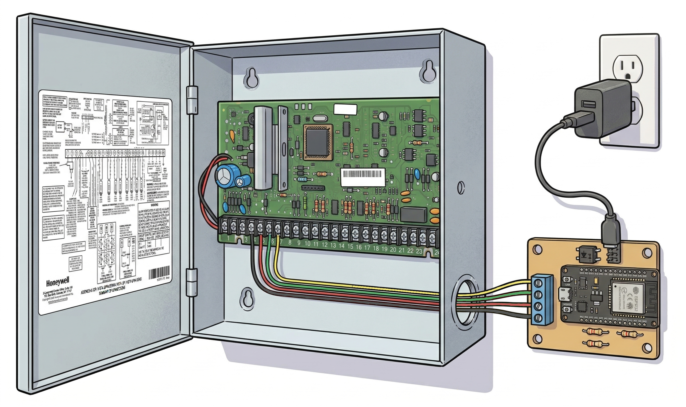
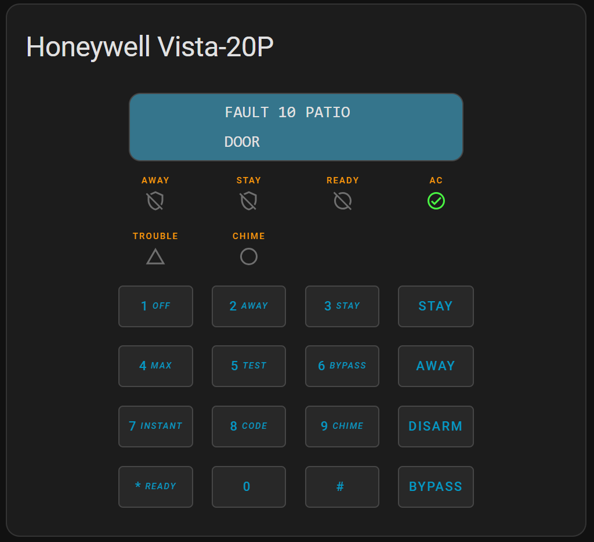
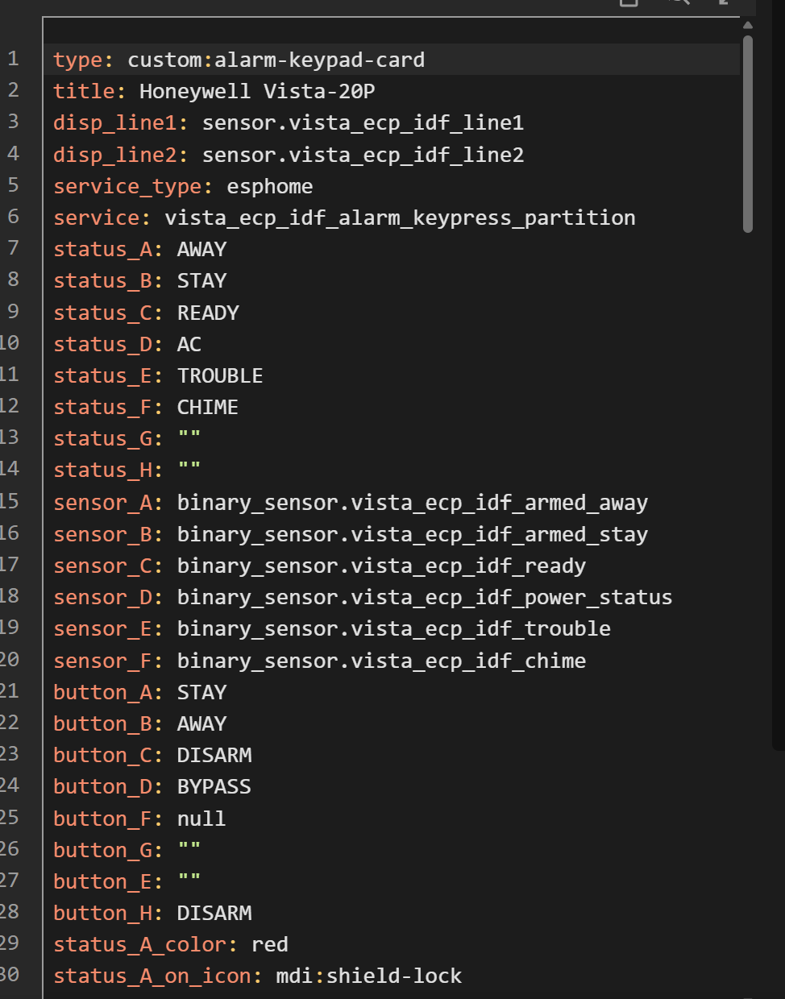

# Honeywell / Resideo Vista Alarm Panel — ESPHome IDF External Component

An [ESPHome](https://esphome.io) external component that interfaces directly with a Honeywell / Resideo / Ademco Vista alarm panel via the ECP keypad bus, enabling full monitoring and control through Home Assistant.

## Supported Panels

| Panel | Protocol |
|---|---|
| Vista 15P / 20P / Ademco 4140XMPT2 | Standard (default) |
| Vista 15SE / 20SE | Legacy (`legacy_protocol: true`) |

> Other Vista-series panels that use the ECP keypad bus may work but have not been tested.

## Key Features

- Monitor zone open/close status (hardwired and RF wireless zones)
- Arm, disarm, and send keypad commands from Home Assistant
- Virtual keypad LCD display (line1/line2 text sensors)
- Zone expansion emulation (adds up to 40 extra zones via expander board emulation)
- RF zone emulation (via RF receiver emulation, 5881ENH compatible)
- Long Range Radio (LRR) monitoring emulation
- AUI interface for faster hardwired zone closure reporting and automatic panel clock sync
- Multi-partition support (up to 8 partitions)
- System status: armed state, ready, trouble, alarm, fire, AC power, battery

## Why This Fork?

This is a highly modified fork of [Dilbert66/esphome-vistaECP](https://github.com/Dilbert66/esphome-vistaECP). Key differences:

- Uses one or two hardware UARTs on the ESP32 instead of software GPIO bit-banging. This provides more reliable, timing-accurate communication with the panel.
- Complete Arduino dependency removed — targets ESP-IDF v5.4+ natively, the recommended ESPHome framework.
- FreeRTOS tasks and queues used for all UART communication and inter-task signalling, including complete fidelity of 2400 baud preamble byte response handling.
- Relay board emulation removed; expander emulation retained.
- Targeted exclusively at the ESPHome API — standalone MQTT removed.
- Additional Config validation added.
- Unified code base supports both Vista SE and Vista 20P protocol via configuration.
- RMT-based pulse capture for hardware-level bus diagnostics.
- ESP8266 not supported.

> ⚠️ Some features carried over from the original project have had minimal testing in this fork, including RF receiver emulation and virtual zone emulation on older SE panels. Please open an issue if you encounter problems.

---

## Prerequisites

- **Hardware**: ESP32 (any variant with at least 2 hardware UARTs). ESP8266 is not supported.
- **ESPHome**: 2024.6 or later recommended.
- **Home Assistant**: Any recent version with the ESPHome integration.
- **Panel programming access**: You will need to enter your panel's installer programming mode to assign a virtual keypad address.

---

## Hardware Wiring

The ESP32 connects to the alarm panel's ECP keypad bus (the four-wire bus that also runs to your physical keypads).

### Bus Wiring Overview

The ECP bus provides four connections:
- **Red** — 12V power (can power the ESP32 via regulator, or use separate 5V supply)
- **Black** — Ground
- **Yellow** — Data from panel to keypad (RX)
- **Green** — Data from keypad to panel (TX)

### Interface Circuit Options

You need a small interface circuit between the 12V ECP bus logic levels and the 3.3V ESP32 GPIOs. Two options are shown below.

**Recommended — Non-isolated simple circuit:**


**Alternative — Non-isolated without optocoupler:**


**Connecting ESP32 to Panel example:**

Other items such as keypads or expansion devices will also be wired to the ECP bus terminals 4 - 7.



### Monitor Pin (Optional)

A second UART input (`monitor_pin`) can be connected to passively monitor traffic from other bus devices such as an RF receiver or zone expanders. This improves zone closure detection accuracy and eliminates the need for the TTL timeout.

---

## Installation

1. **Copy the example YAML** from this repo ([vista-ecp-idf.yaml](vista-ecp-idf.yaml)) into your ESPHome config directory and rename it as desired.

2. **Add secrets** to your `secrets.yaml`:
   ```yaml
   access_code: "1234"
   wifi_ssid: "YourNetwork"
   wifi_password: "YourPassword"
   ```

3. **Program a virtual keypad address** into your alarm panel:
   - Vista 15P/20P: Enter installer programming and use fields `*190`–`*197` to assign an unused keypad address (e.g. 20) to each partition you want to monitor.
   - Vista 15SE/20SE: Use address 31.
   - The chosen address must not conflict with any physical keypads already on the bus.

4. **Set the external component source** in the YAML. The default points to this GitHub repo and branch:
   ```yaml
   external_components:
     - source: github://pletch/esphome-vistaECP-idf@idf
       components: [vista_alarm_panel]
       refresh: 10min
   ```
   Alternatively, clone the repo and use a local path:
   ```yaml
   external_components:
     - source: components
       components: [vista_alarm_panel]
   ```

5. **Edit the `vista_alarm_panel:` section** of the YAML to match your panel, pin assignments, and desired partitions.

6. **Flash the ESP32** using `esphome run your-config.yaml`.

7. **Add to Home Assistant** via the ESPHome integration — it will auto-discover the device.

---

## Home Assistant Lovelace Card

A custom alarm keypad card is included in the [`ha_cards/`](ha_cards/) folder:
- `alarm-keypad-card.js` — custom card providing a keypad UI
- `lovelace.yaml` — example dashboard configuration

Install the JS file as a local resource in Home Assistant (Dashboards → Resources), then use the example YAML to add the card to your dashboard. Edit the device and sensor names to match those associated with the esphome device.





---

## YAML Configuration Reference

### `vista_alarm_panel:` component

```yaml
vista_alarm_panel:
  keypad_addr_1: 20
  rx_pin: 21
  tx_pin: 23
  uart_1: 1
```

| Parameter | Required | Type | Default | Description |
|---|---|---|---|---|
| `keypad_addr_1` … `keypad_addr_8` | At least one required | int | 0 | Virtual keypad address for partitions 1–8. Must be assigned in panel programming (`*190`–`*197` on Vista 20P). Set to 0 or omit to disable. Must not conflict with physical keypads. |
| `rx_pin` | Required | PIN | — | GPIO pin for UART data receive (yellow wire from panel) |
| `tx_pin` | Required | PIN | — | GPIO pin for UART data transmit (green wire to panel) |
| `uart_1` | Required | int | — | Hardware UART number (1 or 2) for main ECP bus TX/RX |
| `access_code` | Optional | string | `""` | Alarm code for arming/disarming. Typically defined in `secrets.yaml`. |
| `quickarm` | Optional | boolean | false | When true, arm commands are sent as `#N` (quick-arm) without an access code prefix. Disarm always requires a code regardless of this setting. |
| `default_partition` | Optional | int | 1 | Main partition number. |
| `aui_addr` | Optional | int | 0 | AUI address from panel field `*189`. Enables faster zone closure reporting for hardwired zones and panel clock sync. Valid values: 1, 2, 5, 6 (0 = disabled). Must not conflict with physical touchpads or Total Connect 2.0 (address 2). Older Vista 20 firmware only supports addresses 1 and 2; newer firmware supports 1, 2, 5, 6. |
| `aui_auto_clock_sync` | Optional | boolean | false | Automatically sync panel clock from ESPHome time. Requires `aui_addr` to be set. Initial sync occurs 2 minutes after boot, then every 6 hours. |
| `monitor_pin` | Optional | PIN | -1 | GPIO pin for passively monitoring bus traffic from RF receivers or expanders. Set to -1 or omit to disable. |
| `uart_2` | Optional | int | -1 | Hardware UART number for monitor pin. Disabled if `monitor_pin` is -1. |
| `ttl` | Optional | int | 30 | Time-to-live in seconds for hardwired zone and fire status before expiring. Used when `monitor_pin` is not configured. |
| `lrr_supervisor` | Optional | boolean | false | Enable Long Range Radio emulation for decoding monitoring status updates. Do not enable if a physical LRR is present in the system. |
| `rf_receiver_emulation` | Optional | boolean | false | Enable RF receiver (5881ENH) emulation to support virtual RF zones. Do not enable if a physical RF receiver is present — the panel only supports one RF receiver. |
| `rf_receiver_addr` | Optional | int | 0 | Address for emulated RF receiver. Only valid address on Vista 15/20 is 0. |
| `legacy_protocol` | Optional | boolean | false | Enable older protocol for Vista 15SE / 20SE panels. |
| `debug_logging` | Optional | boolean | false | Enable verbose ECP packet logging. Requires ESPHome logger level `DEBUG` or higher. |
| `debug_pulsing` | Optional | boolean | false | Use ESP32 RMT peripheral to capture raw bus pulse timings to the log. Output begins 60 seconds after startup. **Do not enable for normal use.** |

---

### `binary_sensor:` — Zone Sensors

Monitor open/closed state of hardwired and RF zones.

```yaml
binary_sensor:
  # Hardwired zone
  - platform: vista_alarm_panel
    id: z8
    name: "Flood Sensor"
    partition: 1
    zone: 8
    device_class: moisture

  # RF wireless zone
  - platform: vista_alarm_panel
    id: z10
    name: "Front Door"
    rf_loop: 2
    device_class: door

  # Emulated hardwired zone (via expander emulation)
  - platform: vista_alarm_panel
    id: z33
    name: "Garage Door"
    partition: 1
    zone: 33
    emulated: true
    device_class: garage_door

  # Emulated RF zone (requires rf_receiver_emulation: true)
  - platform: vista_alarm_panel
    id: z34
    name: "Office Motion"
    partition: 1
    zone: 34
    rf_serial: 123456
    rf_loop: 1
    emulated: true
    device_class: motion
```

| Parameter | Required | Description |
|---|---|---|
| `zone` | Required (for zone sensors) | Panel zone number (1–128). |
| `partition` | Optional | Partition number the zone belongs to. |
| `rf_serial` | Optional | RF device serial number (no leading zeros). Required with `rf_loop` for RF zones. |
| `rf_loop` | Optional | RF device loop number (1–4). Required with `rf_serial`. Most devices use loop 1 (e.g. 5800PIR); 5816 uses loop 2. See the [5800 device list](https://advancedsecurityllc.com/wp-content/uploads/5800%20Wireless%20Device%20List.pdf). |
| `emulated` | Optional | Enable zone emulation. Without RF options: emulates a hardwired zone via automatic expander board emulation (zone must be > 8). With RF options and `rf_receiver_emulation: true`: emulates an RF zone. |

**Emulated hardwired zone → expander address mapping:**

| Zone range | Expander address (20P) | Expander address (SE legacy) |
|---|---|---|
| 9–16 | 7 | — |
| 10–17 | — | 1 |
| 17–24 | 8 | — |
| 25–32 | 9 | — |
| 33–40 | 10 | — |
| 41–48 | 11 | — |

Ensure emulated zone numbers do not conflict with zones already used by physical expander boards in your system.

**Attaching a Home Assistant entity to an emulated zone:**

```yaml
  - platform: homeassistant
    name: "HA Input Boolean"
    entity_id: input_boolean.example
    on_press:
      - lambda: |-
          id(VistaAlarm)->set_zone_fault(33, 1);
    on_release:
      - lambda: |-
          id(VistaAlarm)->set_zone_fault(33, 0);
```

---

### `binary_sensor:` — Status Indicators

Monitor system and partition states using `status_indicator:` instead of `zone:`.

```yaml
binary_sensor:
  - platform: vista_alarm_panel
    id: rdy_1
    name: "Ready"
    partition: 1
    status_indicator: "ready"

  - platform: vista_alarm_panel
    id: ac
    name: "Power Status"
    status_indicator: "ac_power"
    device_class: plug
```

| `status_indicator` value | Partition required | Description |
|---|---|---|
| `ready` | Yes | Partition ready to arm |
| `trouble` | Yes | Trouble condition on partition |
| `bypass` | Yes | Zone bypass active on partition |
| `armed` | Yes | Partition armed (any mode) |
| `armed_away` | Yes | Armed away mode |
| `armed_stay` | Yes | Armed stay mode |
| `armed_instant` | Yes | Armed instant mode |
| `armed_night` | Yes | Armed night mode |
| `chime` | Yes | Chime mode active |
| `alarm` | Yes | Alarm triggered |
| `fire` | Yes | Fire alarm active |
| `ac_power` | No | AC power present (panel-wide) |
| `battery` | No | Battery status (panel-wide) |

---

### `text_sensor:` — Text Status

```yaml
text_sensor:
  # Keypad LCD display lines
  - platform: vista_alarm_panel
    name: "Line1"
    id: ln1_1
    partition: 1
    type: "line1"

  - platform: vista_alarm_panel
    name: "Line2"
    id: ln2_1
    partition: 1
    type: "line2"

  # System status string for HA alarm panel card
  - platform: vista_alarm_panel
    id: ss_1
    name: "System Status"
    icon: "mdi:shield"
    type: "system_status"
    partition: 1

  # Zone open/bypass/trouble/alarm status string
  - platform: vista_alarm_panel
    name: "Kitchen Motion Txt"
    id: z13_txt
    type: "zone"
    zone: 13
    partition: 1
```

| `type` value | Partition required | Description |
|---|---|---|
| `line1` | Yes | Keypad LCD line 1 text |
| `line2` | Yes | Keypad LCD line 2 text |
| `system_status` | Yes | System status string (e.g. `disarmed`, `armed_away`, `not_ready`). Useful for the HA alarm panel card. |
| `beeps` | Yes | Keypad beep count |
| `zone` | Yes (+ `zone:`) | Per-zone status string. Values: `O`=open, `B`=bypass, `T`=trouble/check, `A`=alarm |
| `zone_status` | No | Combined status string for all zones with active states |
| `lrr_messages` | No | Long Range Radio status messages (requires `lrr_supervisor: true`) |
| `rf_messages` | No | RF device messages (requires `rf_receiver_emulation: true` or physical RF receiver monitored via `monitor_pin`) |

> The `system_status` sensor can be filtered to rename values for the HA alarm panel card:
> ```yaml
>     filters:
>       - lambda: |-
>           if (x == "not_ready") x = "disarmed";
>           return x;
> ```

---

## Example Log Output

### Working Vista 20P installation (standard protocol)

```
[13:04:52.169][D][vista-alarm:554][pRQtask]: (PANEL-->KPD) [13:04:51.73] F7 00 00 FB 10 08 00 1C 08 02 00 00 2A 2A ...
[13:04:52.172][I][vista-alarm:063][pRQtask]: Partition: 1
[13:04:52.174][I][vista-alarm:064][pRQtask]: Prompt: ****DISARMED****
[13:04:52.177][I][vista-alarm:065][pRQtask]: Prompt:   Ready to Arm
[13:04:52.179][I][vista-alarm:066][pRQtask]: Beeps: 0
[13:05:13.196][D][vista-alarm:554][pRQtask]: (PANEL-->RFR) [13:05:12.75] FB 02 25 81 5D
[13:05:13.215][D][vista-alarm:554][pRQtask]: (RFR-->PANEL) [13:05:12.77] 00 21 00 DF
[13:05:22.196][D][vista-alarm:554][pRQtask]: (PANEL-->EXP) [13:05:21.75] FA 01 04 25 F7 E5
[13:05:22.216][D][vista-alarm:554][pRQtask]: (EXP-->PANEL) [13:05:21.78] F0 31 00 00 DF
```

### Working Vista 20SE installation (legacy protocol)

```
[20:17:27.643][D][vista-alarm:386]: Writing keys: 12 to partition 1
[20:17:27.994][D][vista-alarm:537][pRQtask]: (KPDL-->PANEL) [20:17:27.353] 01 01 01 
[20:17:28.338][D][vista-alarm:537][pRQtask]: (PANEL-->KPDL) [20:17:27.701] 00 00 5C 08 00 
[20:17:28.575][D][vista-alarm:537][pRQtask]: (PANEL-->KPDL) [20:17:27.931] FE 53 59 53 54 
[20:17:28.815][D][vista-alarm:537][pRQtask]: (PANEL-->KPDL) [20:17:28.167] FF 45 4D 20 4C 
[20:17:29.040][D][vista-alarm:537][pRQtask]: (PANEL-->KPDL) [20:17:28.403] FF 4F 20 42 41 
[20:17:29.275][D][vista-alarm:537][pRQtask]: (PANEL-->KPDL) [20:17:28.638] FF 54 20 20 20 
[20:17:29.531][D][vista-alarm:537][pRQtask]: (KPDL-->PANEL) [20:17:28.894] 02 
[20:17:29.555][D][vista-alarm:537][pRQtask]: (PANEL-->KPDL) [20:17:28.918] FE 03 20 20 20 
[20:17:29.632][D][vista-alarm:537][pRQtask]: (KPDL-->PANEL) [20:17:28.990] 02 02 02 
[20:17:29.793][D][vista-alarm:537][pRQtask]: (PANEL-->KPDL) [20:17:29.156] FE 03 20 20 20 
[20:17:30.029][D][vista-alarm:537][pRQtask]: (PANEL-->KPDL) [20:17:29.392] FF 20 20 20 20 
[20:17:30.265][D][vista-alarm:537][pRQtask]: (PANEL-->KPDL) [20:17:29.627] FF 20 20 20 20 
[20:17:32.222][D][vista-alarm:537][pRQtask]: (PANEL-->KPDL) [20:17:31.585] 00 00 5C 08 00 
[20:17:32.453][D][vista-alarm:537][pRQtask]: (PANEL-->KPDL) [20:17:31.815] FE 2A 2A 2A 2A 
[20:17:32.690][D][vista-alarm:537][pRQtask]: (PANEL-->KPDL) [20:17:32.051] FF 44 49 53 41 
[20:17:32.924][D][vista-alarm:537][pRQtask]: (PANEL-->KPDL) [20:17:32.286] FF 52 4D 45 44 
[20:17:33.159][D][vista-alarm:537][pRQtask]: (PANEL-->KPDL) [20:17:32.522] FF 2A 2A 2A 2A 
[20:17:33.442][D][vista-alarm:537][pRQtask]: (PANEL-->KPDL) [20:17:32.805] FF 20 20 52 45 
[20:17:33.685][D][vista-alarm:537][pRQtask]: (PANEL-->KPDL) [20:17:33.040] FF 41 44 59 20 
[20:17:33.915][D][vista-alarm:537][pRQtask]: (PANEL-->KPDL) [20:17:33.276] FF 54 4F 20 41 
[20:17:34.151][D][vista-alarm:537][pRQtask]: (PANEL-->KPDL) [20:17:33.511] FF 52 4D 20 20 
[20:17:34.152][D][text_sensor:120][pRQtask]: 'Line1' >> '****DISARMED****'
[20:17:34.152][D][text_sensor:120][pRQtask]: 'Line2' >> '  READY TO ARM  '
[20:17:34.152][I][vista-alarm:113][pRQtask]: Partition: 1
[20:17:34.156][I][vista-alarm:115][pRQtask]: Prompt: ****DISARMED****
[20:17:34.156][I][vista-alarm:116][pRQtask]: Prompt:   READY TO ARM  
[20:17:34.160][I][vista-alarm:117][pRQtask]: Beeps: 0
```

### `debug_pulsing` output (1 minute after startup, Vista 20P)

```
[10:06:37][E][vistabus:388][uart_rx_tx_task]: Collecting pulse pattern at 61412112
[10:06:37][I][vistabus:161][uart_rx_tx_task]: Received 4 symbols
[10:06:37][I][vistabus:167][uart_rx_tx_task]: Low Duration(us): 13037  High Duration(us) 02007
[10:06:37][I][vistabus:167][uart_rx_tx_task]: Low Duration(us): 01019  High Duration(us) 02007
[10:06:37][I][vistabus:167][uart_rx_tx_task]: Low Duration(us): 01019  High Duration(us) 02006
[10:06:37][I][vistabus:167][uart_rx_tx_task]: Low Duration(us): 01020  High Duration(us) 00000
[10:06:37][D][esp-idf:000][uart_rx_tx_task]: I (62010) gpio: GPIO[22]| InputEn: 0| OutputEn: 0| OpenDrain: 0| Pullup: 1| Pulldown: 0| Intr:0
[10:06:37]
[10:06:37][E][vistabus:388][uart_rx_tx_task]: Collecting pulse pattern at 61742110
[10:06:37][D][esp-idf:000][uart_rx_tx_task]: I (62021) gpio: GPIO[22]| InputEn: 1| OutputEn: 0| OpenDrain: 0| Pullup: 1| Pulldown: 0| Intr:0
[10:06:37]
[10:06:37][I][vistabus:161][uart_rx_tx_task]: Received 18 symbols
[10:06:37][I][vistabus:167][uart_rx_tx_task]: Low Duration(us): 06051  High Duration(us) 06036
[10:06:37][I][vistabus:167][uart_rx_tx_task]: Low Duration(us): 01016  High Duration(us) 00847
```
